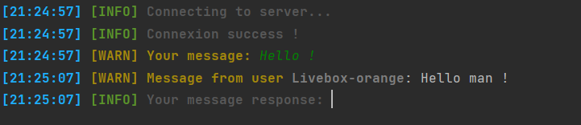
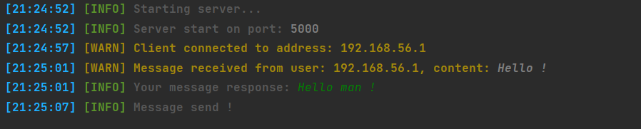

# PythonMessagerLocal
Simple messager in python used socket 

# installation 

```CMD
pip install simple-chalk
git clone https://github.com/Refaltor77/PythonMessagerLocal
```
to start server
```CMD
python server.py
```
to connect to server
```CMD
python client.py
```

# usage
You can chat from server.py and reply to client messages :)

# images
the client: </br>



the server: </br>

